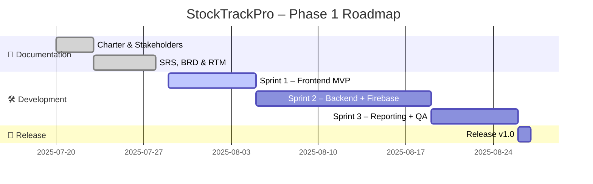

# 📦 StockTrackPro – Stock Management System

**Amarion Technologies** proudly presents **StockTrackPro**, a robust inventory management solution built with Flutter frontend, Spring Boot backend, and Firebase integration.

---

## 📁 Project Documents (Phase 1)

| Document | Description | Download |
|----------|-------------|----------|
| **Project Charter** | Defines objectives, scope, and stakeholders | [📄 Download](https://github.com/Amarsalim30/Stock-Management-System/raw/master/Frontend/docs/%23%23%23%20%F0%9F%94%B9%20Phase%201%20Initiation%20%26%20Requirements/1.StockTrackPro_Project_Charter.docx) |
| **Software Requirements Specification (SRS)** | Functional and non-functional requirements | [📄 Download](https://github.com/Amarsalim30/Stock-Management-System/raw/master/Frontend/docs/%23%23%23%20Phase%201%20Initiation%20%26%20Requirements/2.Software%20Requirements%20Specification.docx) |
| **Business Requirements Document (BRD)** | Business goals and features | [📄 Download](https://github.com/Amarsalim30/Stock-Management-System/raw/master/Frontend/docs/%23%23%23%20Phase%201%20Initiation%20%26%20Requirements/3.Business%20Requirements%20Document.docx) |
| **Stakeholder Register** | Stakeholder info and engagement strategy | [📄 Download](https://github.com/Amarsalim30/Stock-Management-System/raw/master/Frontend/docs/%23%23%23%20Phase%201%20Initiation%20%26%20Requirements/5.Stakeholder%20Register.docx) |
| **Requirements Traceability Matrix (RTM)** | Links requirements to design & test coverage | [📄 Download](https://github.com/Amarsalim30/Stock-Management-System/raw/master/Frontend/docs/project-automation/rtm_stocktrackpro.docx) |

---

## 🚀 Project Roadmap

### 🗓️ Phase 1 Timeline


```code
Sprint 1 – Frontend MVP
├─ FR-001: Product Creation (Backlog → In Progress)
├─ FR-002: Product Editing (Ready)
├─ FR-004: RBAC Implementation (Testing)
└─ FR-008: Supplier Management (Complete)
```
---
🛠 Technologies & Stack
Frontend: Flutter (Clean Architecture, MVVM)

Backend: Spring Boot (REST API)

Database: Firebase Firestore

Authentication: Firebase Auth

CI/CD & Tasks: GitHub Projects + GitHub Actions

📞 Contacts
Role	                 Name	                  Email
Product Owner	Amar Salim Batheif	asabatheif@gmail.com
Client	        Zeyn Caterers Ltd.	zeyn@zeyn.co.ke


Built with ❤️ by Amarion Technologies – Clarity Engineered.
---
